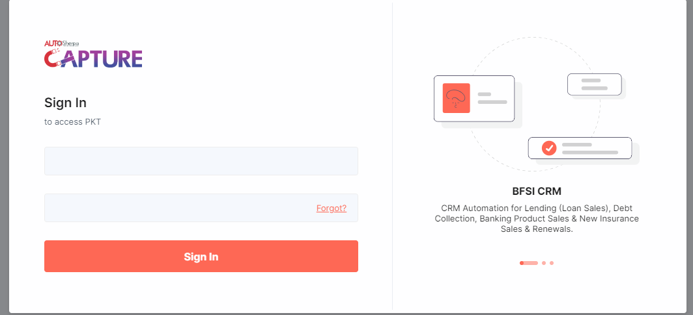
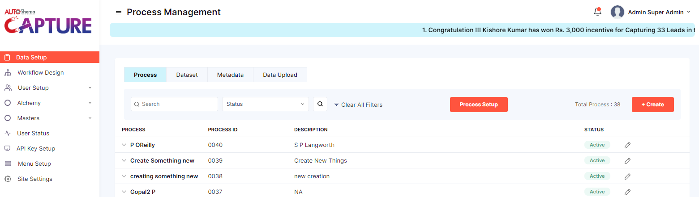
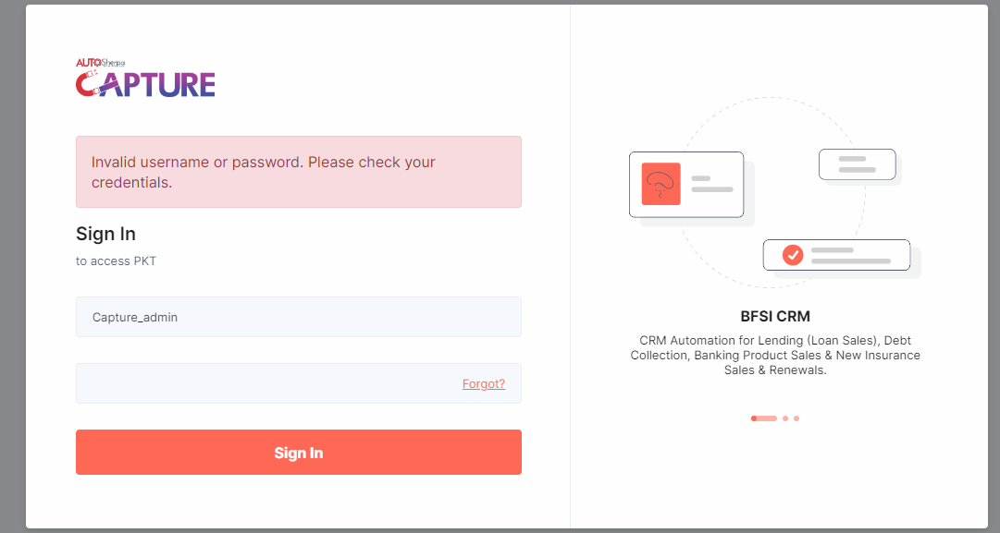

# PKT LOGIN DOCUMENTATION

Welcome to the documentation for logging in to transmon Autosherpa! This guide will walk you through the steps to log in to your account and access its features.

**LOGGING IN**

To log in to your Account , follow these steps:

**STEP 1: Open the link**

Open a _web browser_ and navigate to the link
[Autosherpa capture PKT](https://pkt-test.transmonqa.in/en/myprofile/login/)

The login page will look like this

**STEP 2: Fill the details**

>> **Username Details** 

    - Need to enter username/login ID
        Type the Valid Username /Type in Valid login Details

>> **Password Details** 

    - Need to enter Password
       - Atleast 1 Uppercase letters (A-Z)
       - Atleast 1 Lowercase letters (a-z)
       - 1 Number (0-9)
       - Atleast 1 Special characters (!@#$%^&*(), etc.)

**STEP 3: Click on Sign In**

If *Valid Details* are filled in during the sign-in process, the user will be *logged in* into the application.

and the page will look like this 

If *Invalid Details* are filled in during the sign-in process, the user will see an *Error Message*

>>invalid details will go with both the username and password even if one is wrong the error message will be same

and the page would look like this 

If you dont remember the password click on forgot password *Follow Step 4*

**STEP 4: If not able to login**

**UNDER DEVLOPMENT**

1. On the password reset page, the user is prompted to enter a new password. They typically need to confirm the new password to ensure it was entered correctly. 

2. After entering and confirming the new password, the user submits the form. The system updates the password for the user's account with the new password.

3. The user receives confirmation that their password has been successfully reset. They can now use the new password to sign in to their account.

