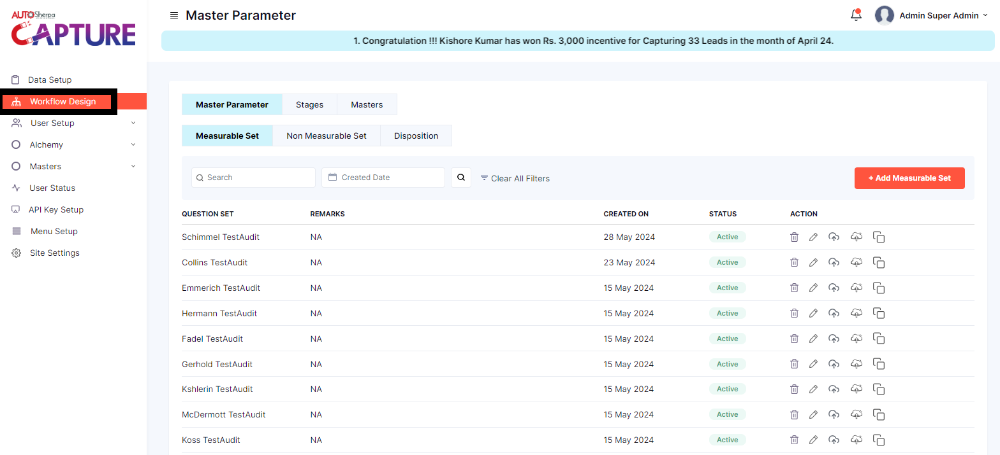
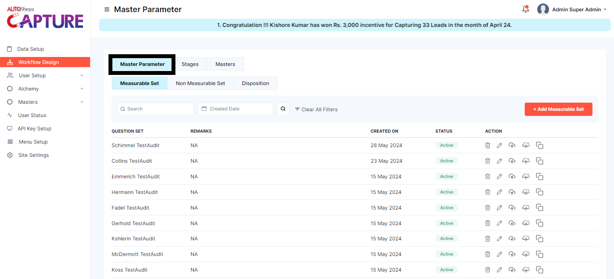
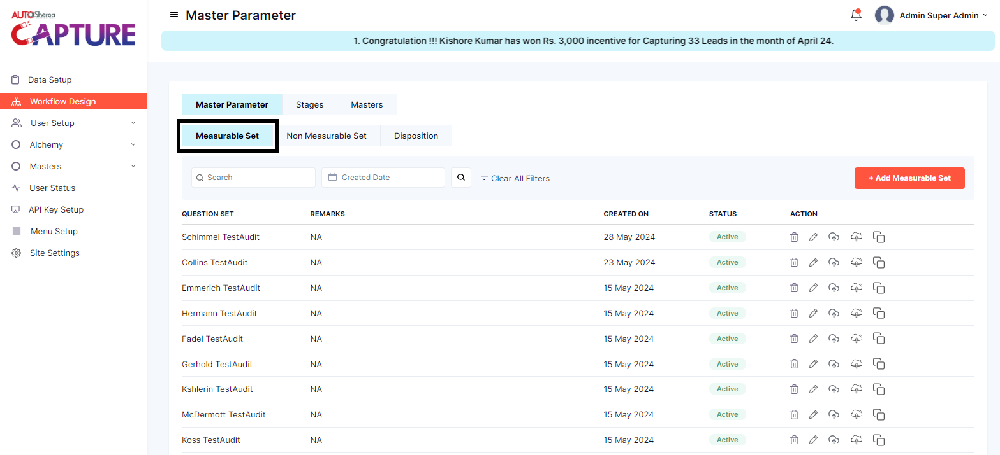
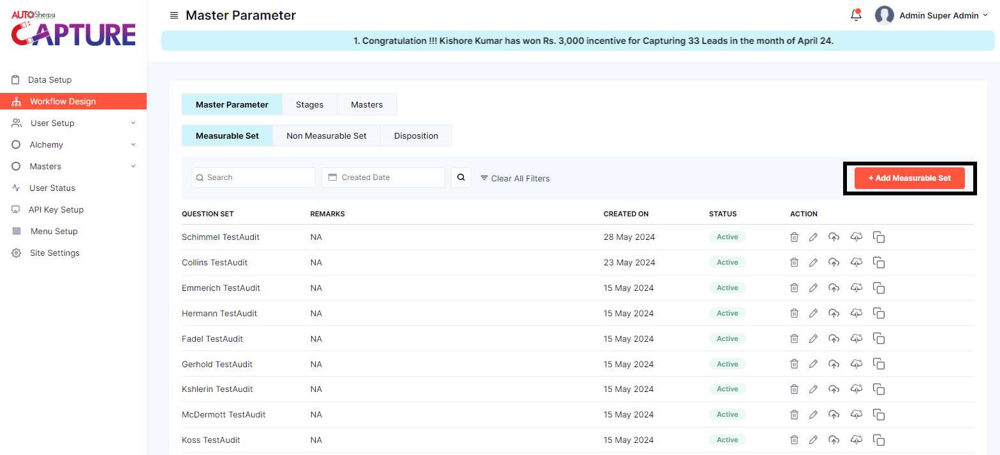
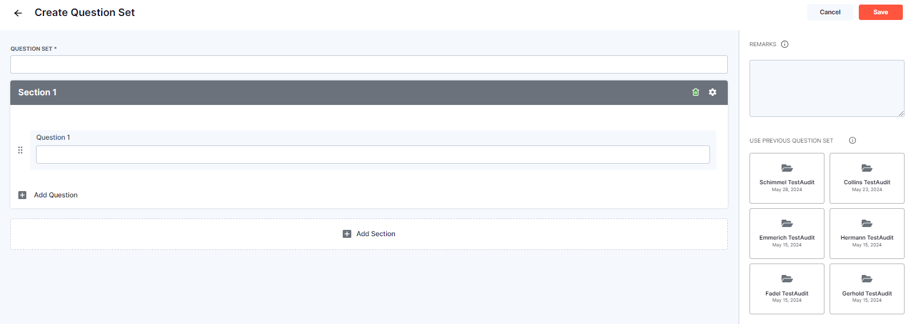

# **WORKFLOW DESIGN**

## MASTER PARAMETERS

### Measurable Set

Once the user is logged in and has to work with workflow design

**STEP 1:Click on Work flow design**

**STEP 2:Click on Mater Parameters**

**STEP 3:Click on Measurable Set**

**STEP 4:Click on Add Measurable Set**

Once measurable set  is clicked the user is asked to create Question set and the page looks like this 

User has to create a new question or has an option to select *USE PREVIOUS QUESTION SET*

User can add any number of questions using *Add Question* or Delete using the *Delete icon*

User has a flexibility to select the type of question from *SELECT QUESTION TYPE*
 
1. as default the first option *Label*

It will be selected and will be highlighted in *Green*

2. If user selects *Multiple choice* 

It will be selected and will be highlighted in *Green*

for any particular Question user has an option to add any number of options 

>>>under this the user has and option to be filled and 
   Weightage
   Set as Default
   Is Fatal
   all the three have toggle option 
user can use the toggle option depending on the question and multiple option given 

3. If user selects *short answer* 

It will be selected and will be highlighted in *Green*

for any particular Question user has an option to add any kind of information for example address, feedback,remarks

>>>The short answer has specific condition where in the min and max length has already been decided from 1 to 250 
   value type is drop down menu 
   Allow sp char has a toggle button and it is set default as allowed 

4. If user selects *Drop down* 

It will be selected and will be highlighted in *Green*

for any particular Question user has an option to add any number of options 
>>>under this the user has and option to be filled and 
   Weightage
   Set as Default
   Is Fatal
   all the three have toggle option 
user can use the toggle option depending on the question and drop down option given 

5. If user selects *Relative Drop down*

It will be selected and will be highlighted in *Green*

under this the user has and option to be filled and 
   Weightage
   Set as Default
   Is Fatal
   all the three have toggle option 
user can use the toggle option depending on the question and drop down option given 

6. If user selects *File Upload*

It will be selected and will be highlighted in *Green*

7. If user selects *Radio button*

It will be selected and will be highlighted in *Green*

8. If user selects *Date*

It will be selected and will be highlighted in *Green*

9. If user selects *Time*

It will be selected and will be highlighted in *Green*

10. If user selects *Text Box*

It will be selected and will be highlighted in *Green*

11. If user selects *Relative multiSelect*

It will be selected and will be highlighted in *Green*
