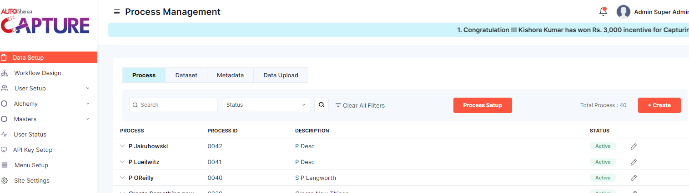
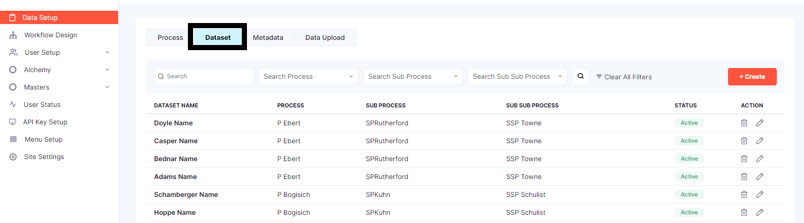
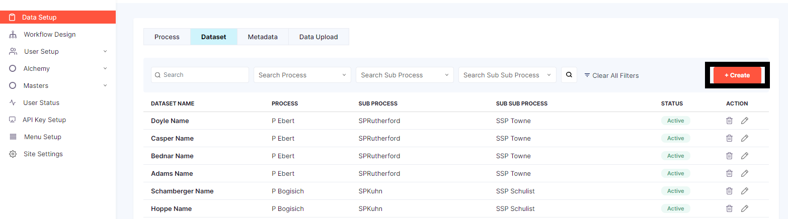
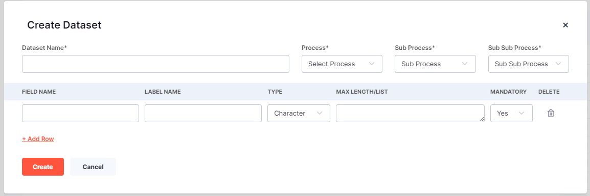
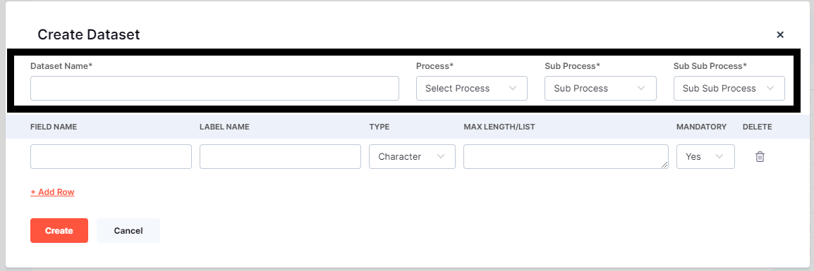
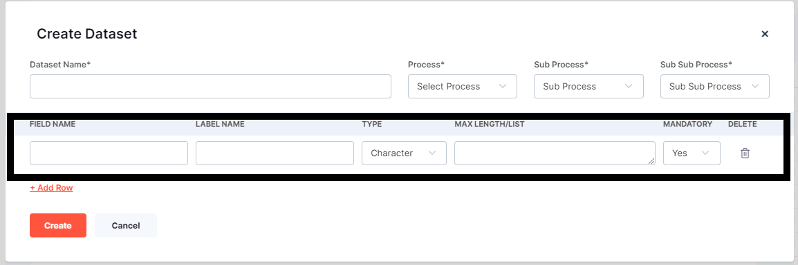
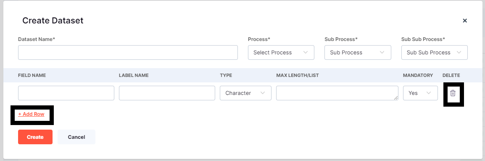
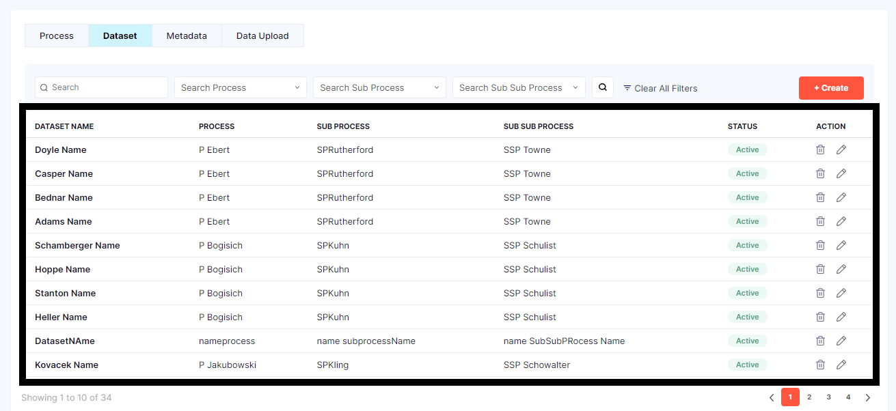
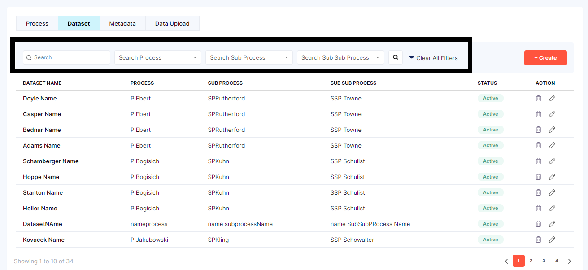

# DATA SETUP-DATASET

**Step 1:Click on Data Setup**

Once the user is logged in click on *Data setup* 

and the page will look like this

**Step 2:Click on Dataset**

on the top right corner there is *Create* button

**Step 3:Click on Create**

The form to be filled will be displayed 

The form shows few Details to be filled 

> User has to create a *Dataset Name* in the textflied 

> Process has to be selected from the dropdown menu

> Sub Process selected from the dropdown menu

> Sub Sub Process selected from the dropdown menu

once the above details are filled and selected the user has to create few more information

> FIELD NAME 

> LABEL NAME

> TYPE drop down menu

> MAXLENGHT/LIST

> MANDATORY drop down menu

In the above field the user can fill the *Field Name* and *Label Name* same or different depending on that the *Type* dropdown has to be  selected , the *Max/lenght* should be given in numerics and the *Mandatory* field drop down should be selected. 

 users can create rows of data dynamically and also have the ability to delete any number of rows as they see fit.

 

 once the data set is created it will be displayed below 

if user has to search any particular data set the user can search using  the serach bar 

