# DATA SETUP-DATA UPLOAD

## MANUAL UPLOAD

**Step 1:Click on Data Setup**

Once the user is logged in click on *Data setup* 

and the page will look like this

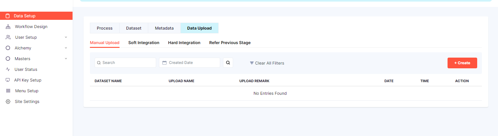

**Step 2:Click on Data Upload**

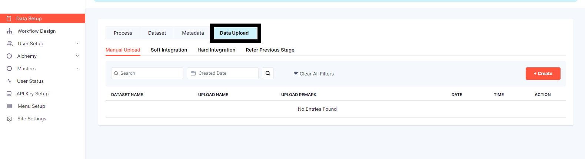

**Step 3:Click on Manual Upload**

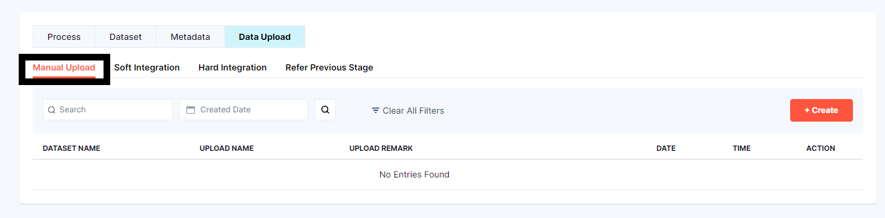

on the top right corner there is *Create* button

**Step 4:Click on Create**

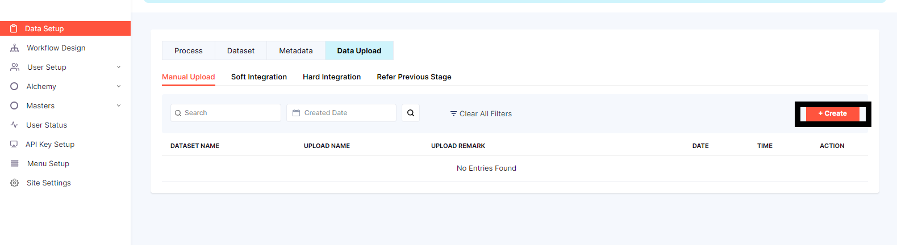

The form to be filled will be displayed 

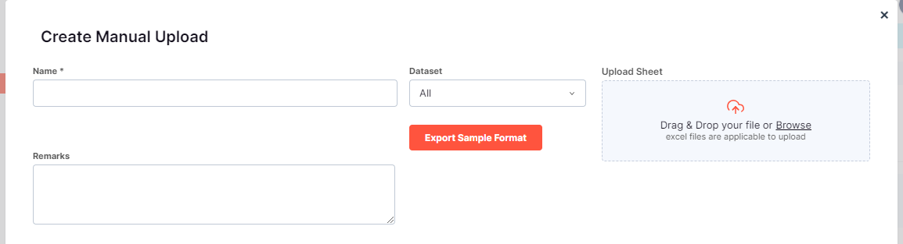

User needs to create a *Name* 

Select a  *Dataset*  from the drop down menu

Add *Remarks* in the textfield 

Once all the details are filled 

**Step 4: click on Export sample format**

Sample format is downloaded and can be opened in excel 

After the file is export the user has to upload sheet in the form

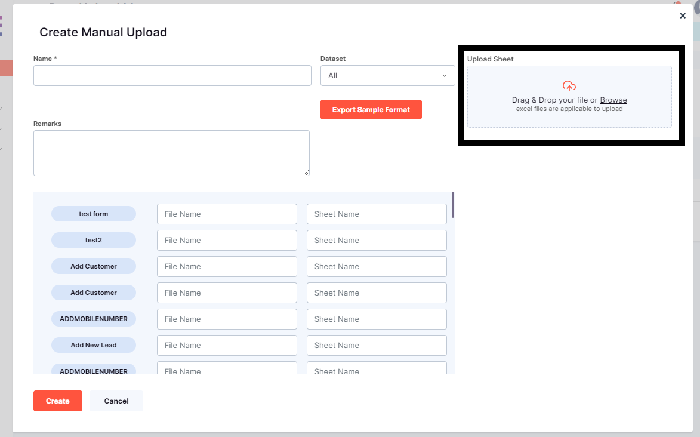

fill in the file name and sheet name and then click on create the file is created 

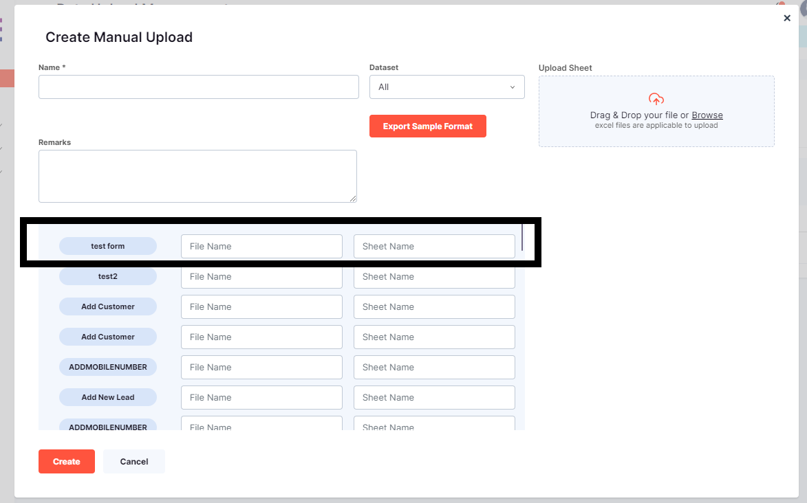

once the data created it is seen below 

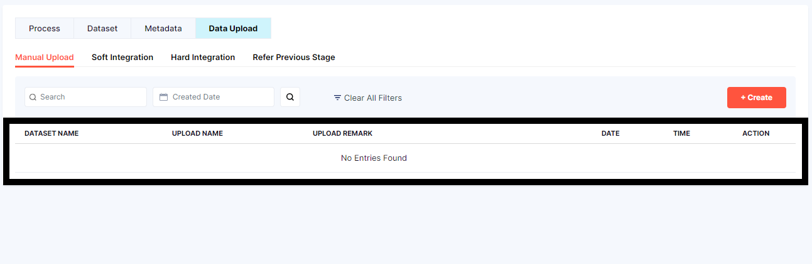

if the user has to search for particular can be searched using the search bar

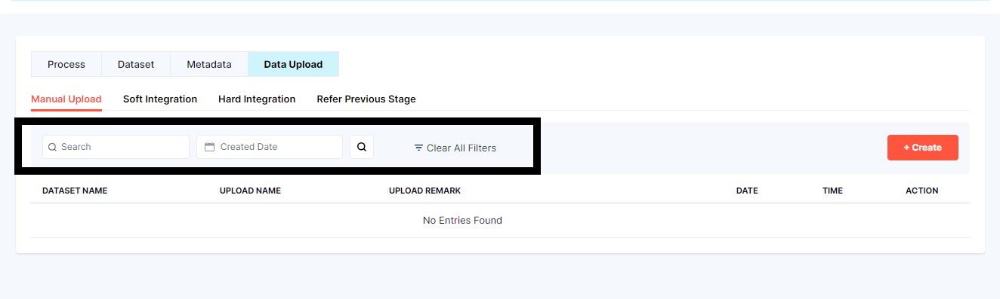

------------------------------------------------------------------------------------------------------------------------------------

------------------------------------------------------------------------------------------------------------------------------------

-------------------------------------------------------------------------------------------------------------------------------------

## SOFT INTEGRATION 

**Step 1:Click on Data Upload**

**Step 2:Click on Soft Integration**

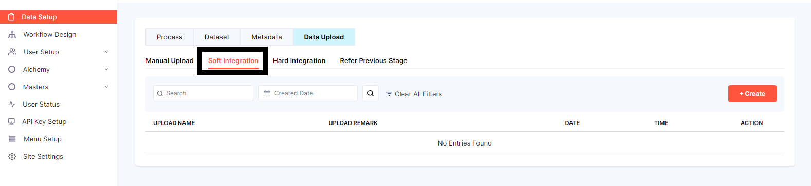

on the top right corner there is *Create* button

**Step 3:Click on Create**

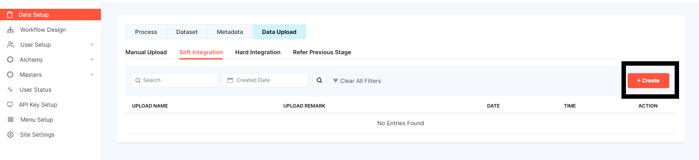

the form to be filled will be popped up 

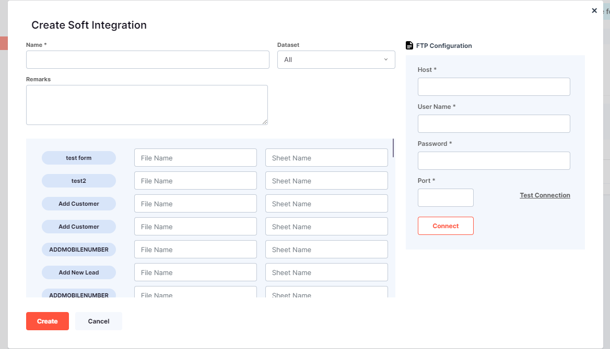

User can create a *Name Field*

*Dataset* is a drop down menu 

User can fill the *Remarks* in the text box

**FTP CONFIGRATION**

Host
User Name
Port 
User needs to fill the information for the above three 

After the details are filled under FTP CONFIGARATION the user needs to test the connection 

CLICK ON *Connect*

The Pop shows if the connection is made or not i.e., if the connection is passed or failed 

Click on Create

once the soft integration form is filled , saved and created the information is showed below

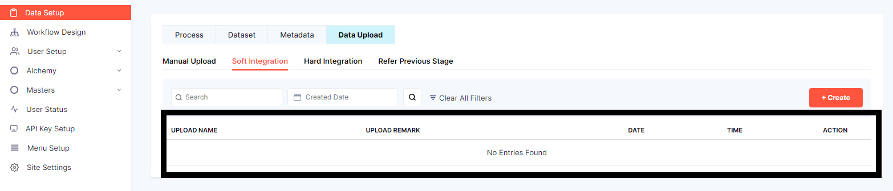

If user has to search particular file can search using the search field 

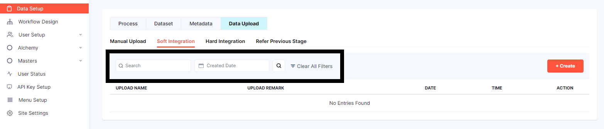

---------------------------------------------------------------------------------------------------------------------------------------------

---------------------------------------------------------------------------------------------------------------------------------------------

---------------------------------------------------------------------------------------------------------------------------------------------

## HARD INTEGRATION 

**Step 1:Click on Data Upload**

**Step 2:Click on Hard Integration**

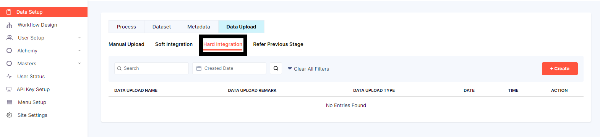

on the top right corner there is *Create* button

**Step 3:Click on Create**

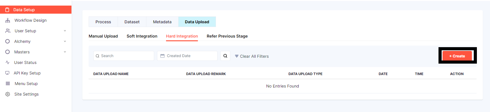

The form to be filled will be popped up 

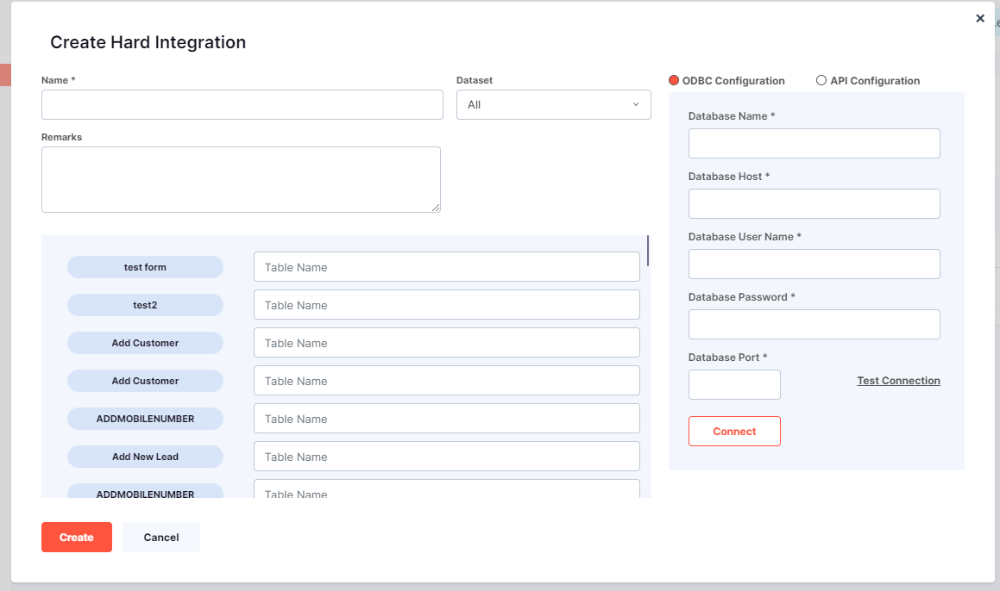

the form has 2 configration to be filled 

1. ODBC Configuration

When the user clicks on the first option the raido button is highlighted and truns orange 
and the form will be 

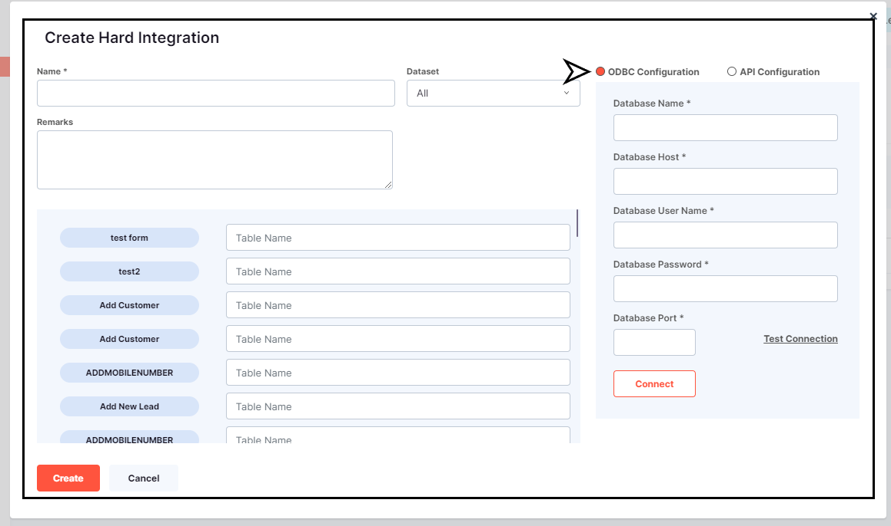

2. API Configuration

When the user clicks on the second option the raido button is highlighted and truns orange 
and the form will be 

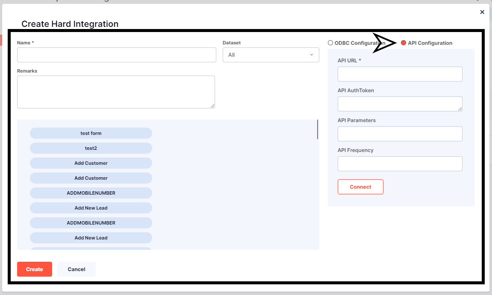

---------------------------------------------------------------------------------------------------------------------------------------------

---------------------------------------------------------------------------------------------------------------------------------------------

---------------------------------------------------------------------------------------------------------------------------------------------

## REFER PREVIOUS STAGE 

**Step 1:Click on Data Upload**

**Step 2:Click on Refer Previous Stage**

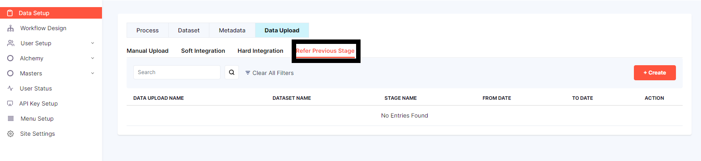

on the top right corner there is *Create* button

**Step 3:Click on Create**

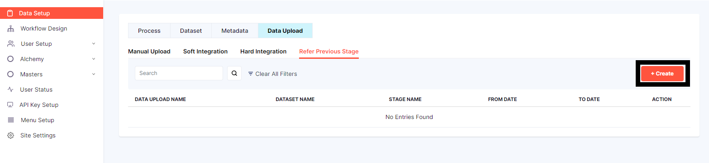

the form to be filled will be popped up 

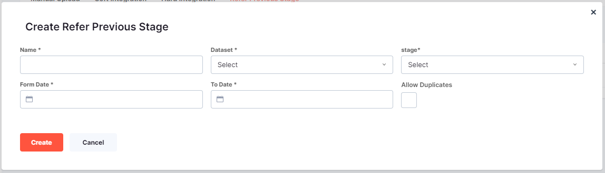

User can create a *Name Field*

*Data Set* User has to select it from the drop down menu 
 
*Stage User* has to select it from the drop down menu

User can select the data range i.e., *From Date to To Date* 

*Allow Duplicates* is check box user can either enable it or disable it 

once the details are filled and created the same thing will be displayed below 

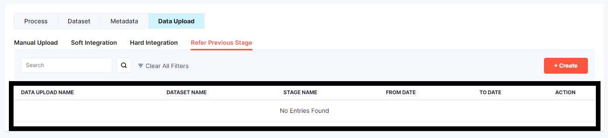

and if the user needs to search any particular file can serach using the search field 

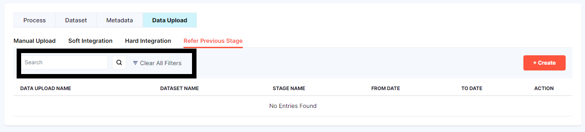

