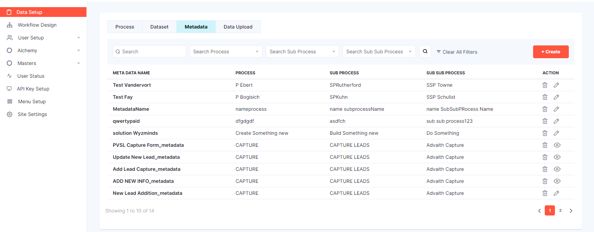
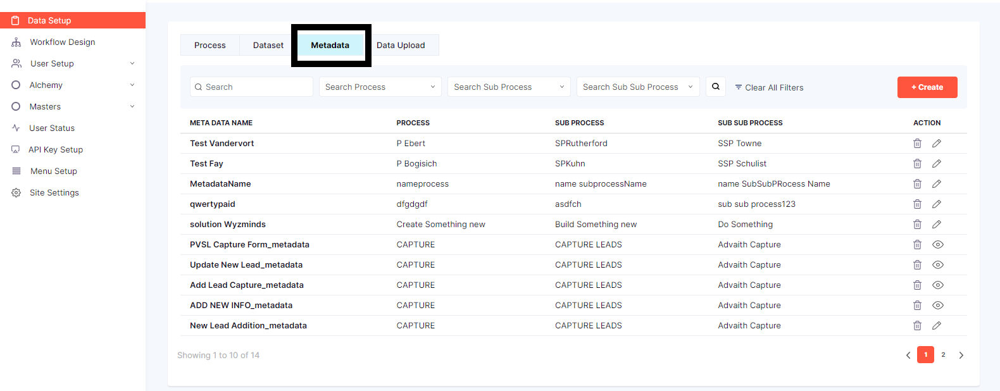
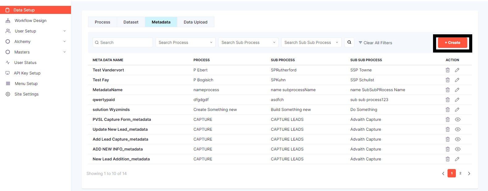
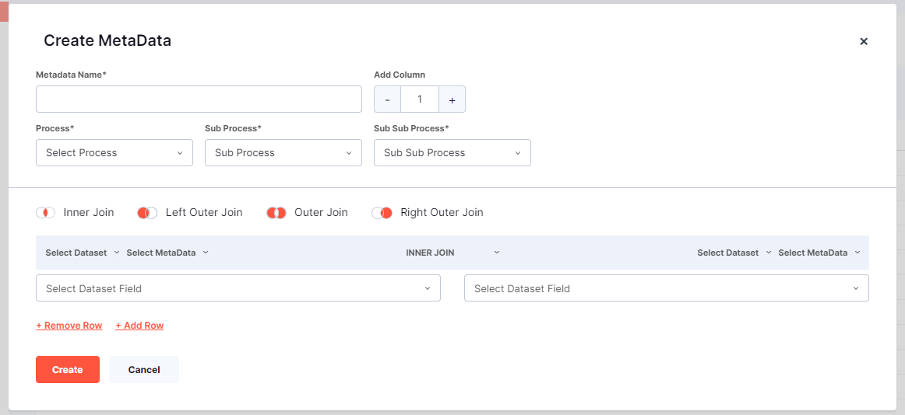
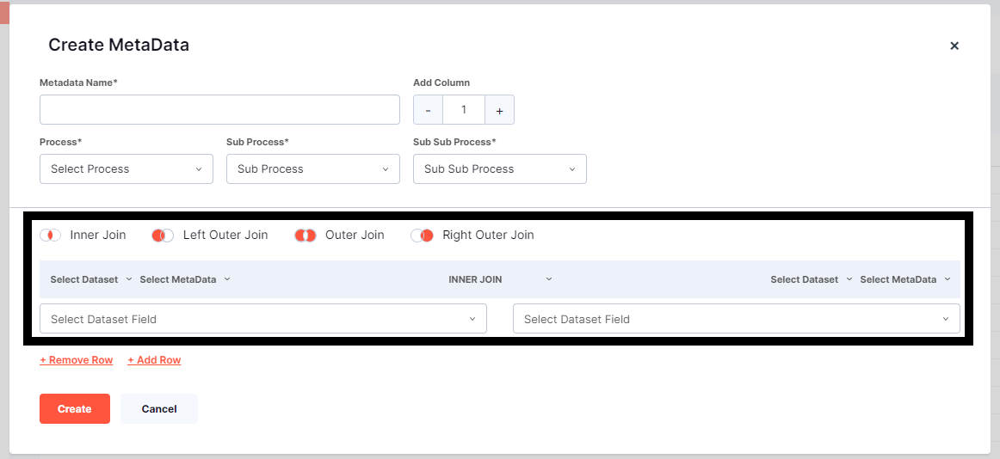
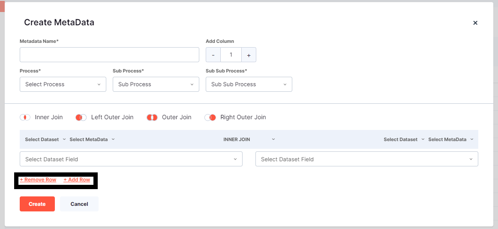
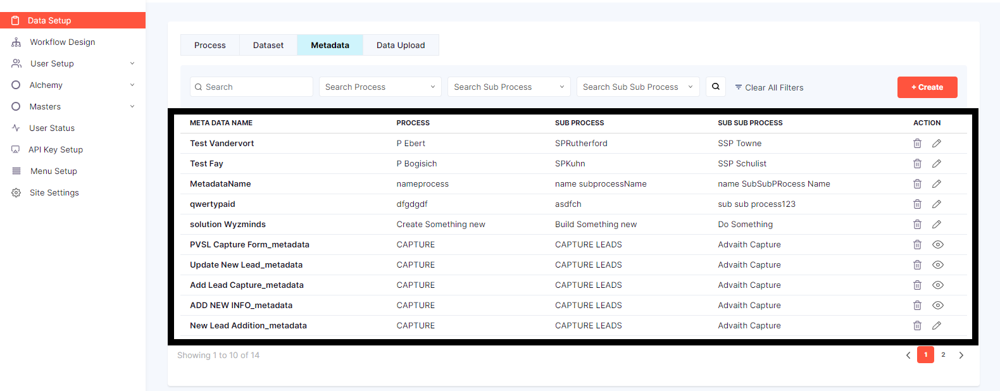
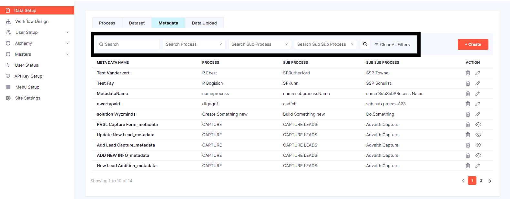

# **DATA SETUP-META DATA**

**STEP 1:Click on Data Setup**

Once the user is logged in click on *Data setup* 

and the page will look like this

**STEP 2:Click on Metadata**

on the top right corner there is *Create* button

**STEP 3:Click on Create**

The form to be filled will be displayed 

>> Metadata Name is a text field
>> User has select Process from the dropdown menu
>> User has select Sub Process from the dropdown menu
>> User has select Sub Sub Process from the dropdown menu

 
User has to select the both *Data Set Field* from the drop down menu 

users can create rows of data dynamically and also have the ability to Remove any number of rows as they see fit.

once the user clicks on the *Create* the metadata is created successfully and a message as displayed 

**Created Metadata**

once the data set is created it will be displayed below 

**Search any particular Metadata**

if user has to search any particular metadata the user can search using  the serach bar 

