# DATA SETUP-PROCESS

## **PROCESS**

once your logged in on the left side there are list of functions which can selected.

**STEP 1 :Click On Data Setup**

 

>>**STEP A :Click on Process**

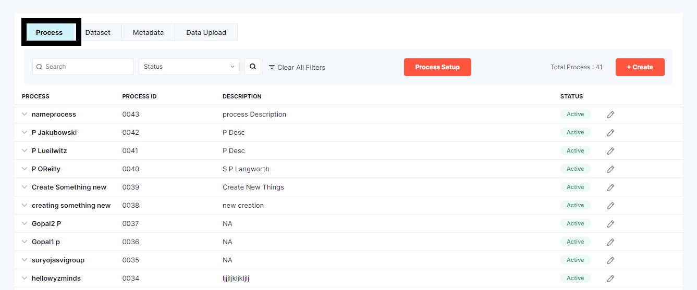

 on the right corner click on *Create button*

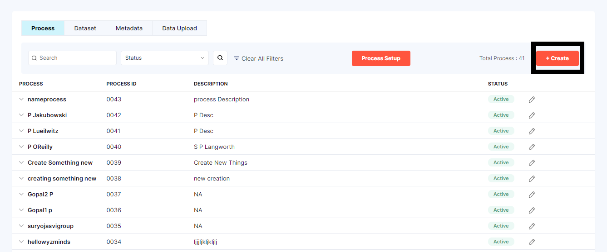

>>**STEP B :Click on the 1st option i.e., Process**

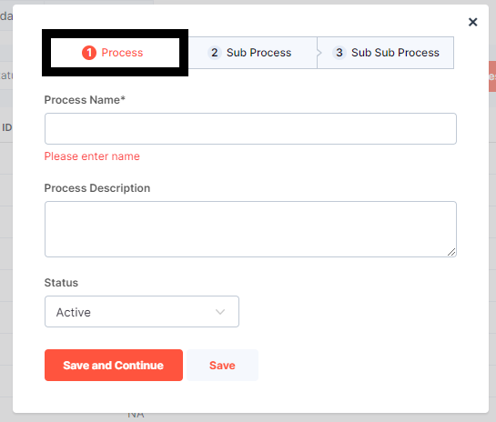

The form to be filled is displayed 

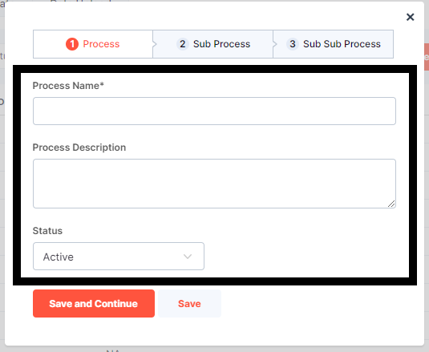

User needs to Fill in the  Process name in a text field

User needs to fill in the Description  in a textarea 
 
Finally,user can select the status from the dropdown menu with "Active" or "Inactive" options.

**STEP 2:Click On Save**

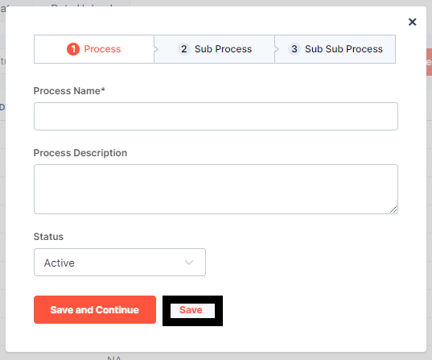

If the other option is selected 

**STEP 3:Click on Save and Continue**

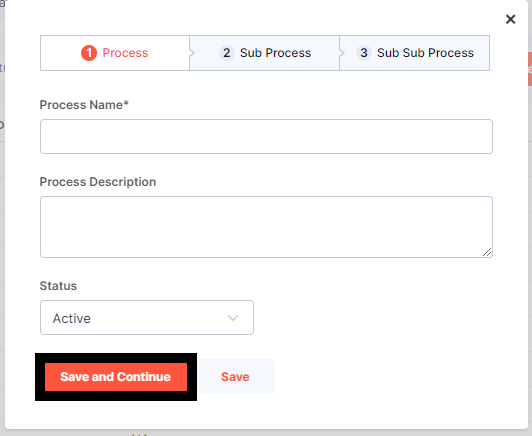

once you click on save and continue user will be taken to the next form i.e., sub process

--------------------------------------------------------------------------------------------------------------------

# **SUB PROCESS**

**STEP 1 :Click on the 2nd option i.e., Sub Process**

The form to be filled is displayed 

The user can select a process from the dropdown menu.

User needs to Fill in the Sub Process name in a text field

User needs to fill in the Description  in a textarea 
 
Finally, they can select the status from the dropdown menu with "Active" or "Inactive" options.

**STEP 2:Click On Save**

 
if the save option is selected The form will be closed.

If the other option is selected 

**STEP 3:Click on Save and Continue**

once you click on save and continue user will be taken to the next form i.e., Sub Sub process

---------------------------------------------------------------------------------------------------------------------

## **SUB SUB PROCESS**

**STEP 1 :Click on the 3rd option i.e., Sub Sub Process**

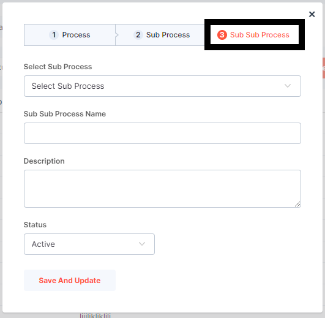

The form to be filled is displayed 

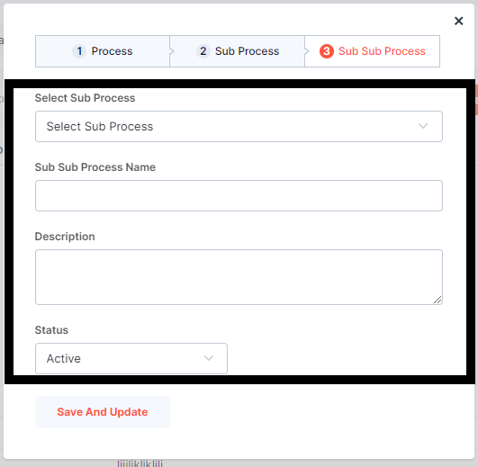

User needs to select the sub process which was created earlier from the dropdown menu

User needs to Fill in the Sub Sub Process name in a text field

User needs to fill in the Description  in a textarea 
 
Finally, they can select the status from the dropdown menu with "Active" or "Inactive" options.

**STEP 2:Click On Save And Update**

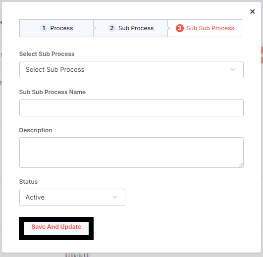
 
once the required information is filled The form will be updated and closed.

The Proces will be created and will displayed below 

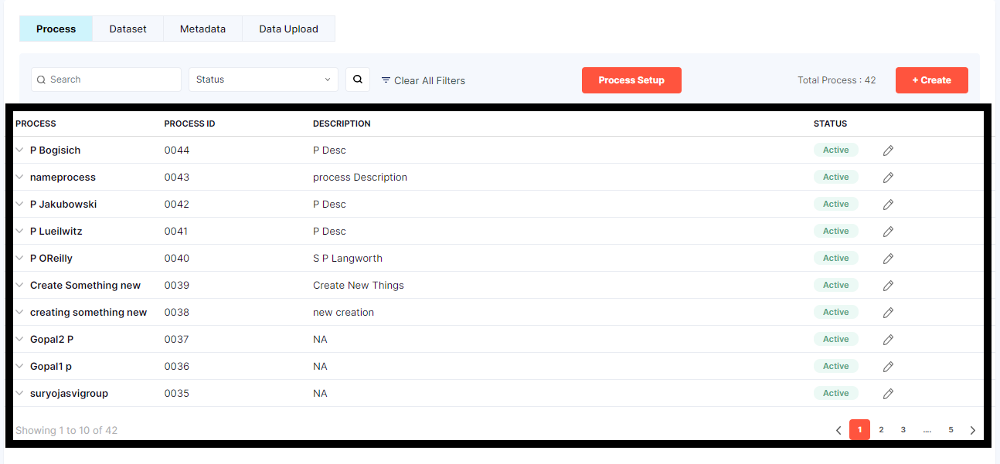

If the created process is not seen in the below list, user can search in the search bar 

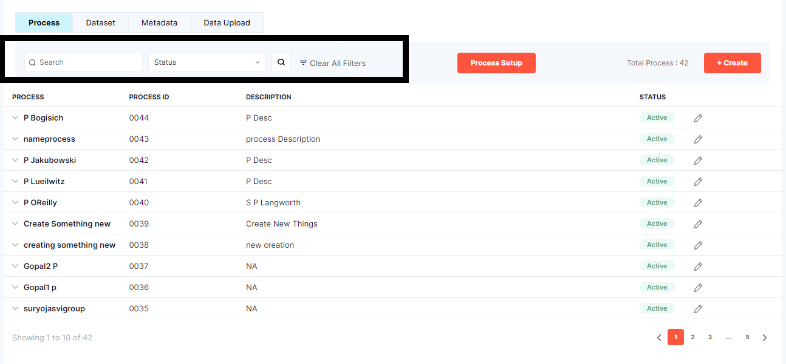

