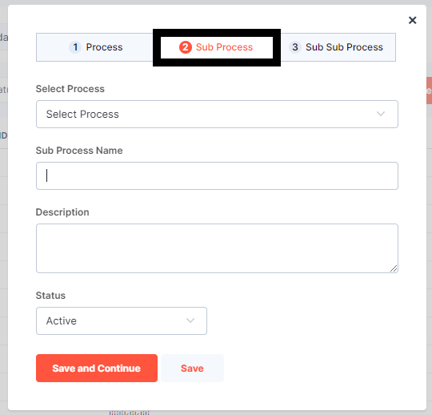
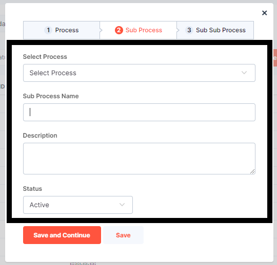
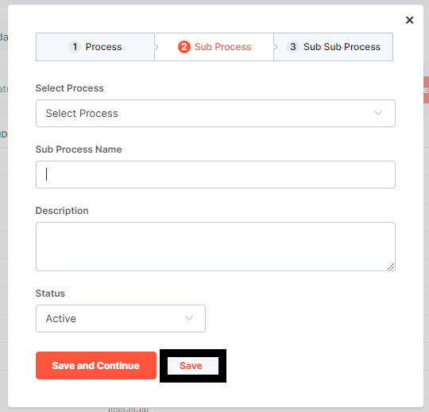
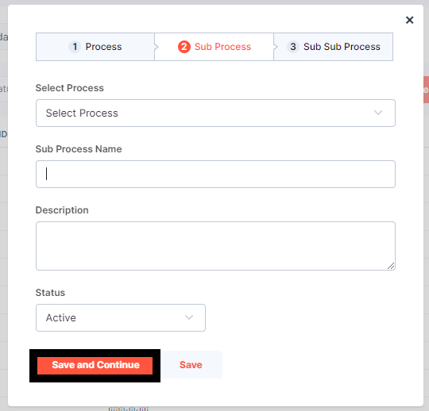

**STEP 1 :Click on the 2nd option i.e., Sub Process**

  The form to be filled is displayed 

  

 The user can select a process from the dropdown menu.

 User needs to Fill in the Sub Process name in a text field

 User needs to fill in the Description  in a textarea 
 
 Finally, they can select the status from the dropdown menu with "Active" or "Inactive" options.

 **STEP 2:Click On Save**

 
 
 if the save option is selected The form will be closed.

 If the other option is selected 

 **STEP 3:Click on Save and Continue**

 

 once you click on save and continue user will be taken to the next form i.e., Sub Sub process