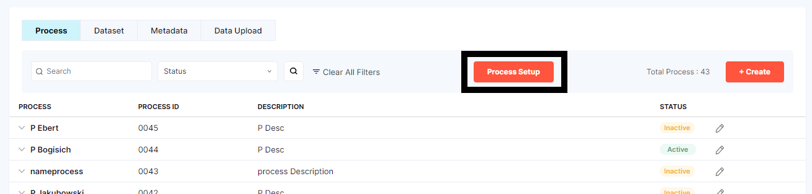
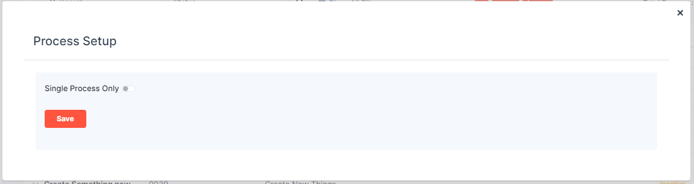
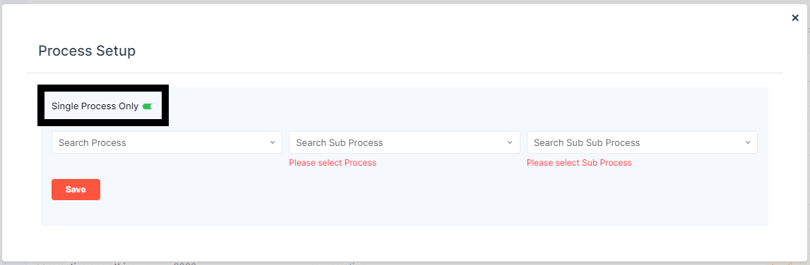
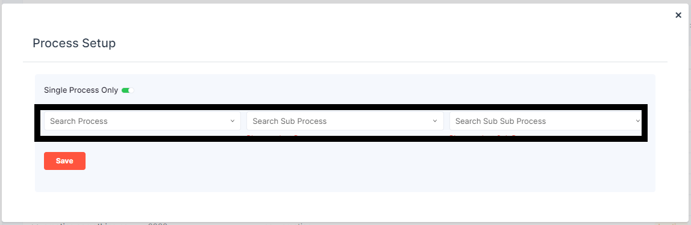
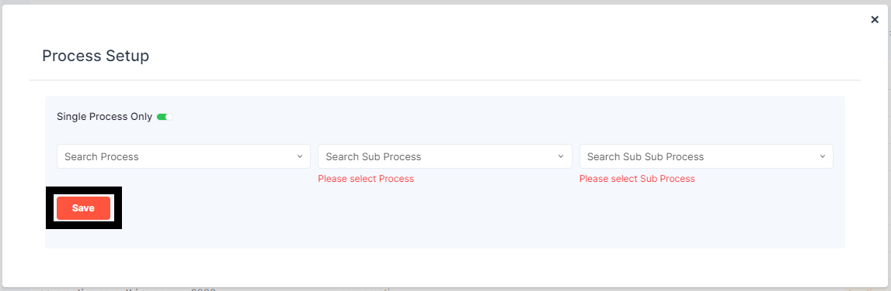
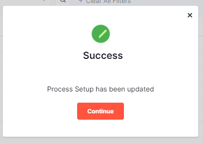

# DATA SETUP-PROCESS-PROCESS SETUP

On the search bar there is *PROCESS SETUP* button when the user clicks on it the a dialouge box is popped up.
 
**STEP 1:Click on Process Setup**

**STEP 2:Process setup dailogue box**

In that dialogue box there is an option called *Single Process Only* it is toggle option.

If the user clicks on *toggle option* it slides to the *RIGHT* and it turns to *GREEN* 

Below that few options are displayed
the user needs can search the 

> Search Process from the dropdown menu

> Search Sub Process from the dropdown menu

> Search Sub Sub Process from the dropdown menu

Once the user fills the details click on save 

**STEP 3:Click on Save**

The pop box shows success and the process has been updated.

